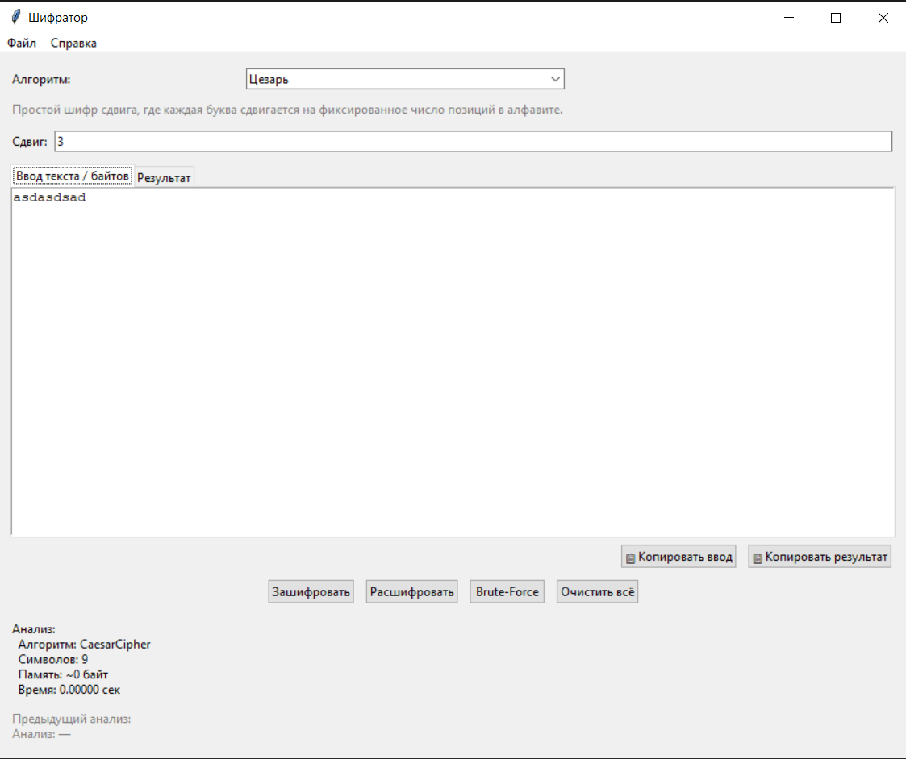

# CipherAnalysisApp

**Программа для шифрования и дешифрования текстов** с использованием нескольких классических и модифицированных алгоритмов шифрования.

---

## Описание

CipherAnalysisApp — это графическое приложение на Python с использованием Tkinter, позволяющее работать с различными алгоритмами шифрования и дешифрования.  
Включает поддержку классических шифров, таких как Цезарь, DES и RSA, а также их модифицированных версий с дополнительными улучшениями безопасности и функционала.

---

## Поддерживаемые алгоритмы и модификации

| Алгоритм         | Описание                                                                                   |
|------------------|--------------------------------------------------------------------------------------------|
| Цезарь           | Простой сдвиговый шифр, сдвигающий буквы на фиксированное количество позиций.             |
| Цезарь (мод)     | Модификация с динамическим сдвигом на основе ключевого слова.                              |
| DES              | Упрощённый DES-подобный шифр с XOR и фиксированным ключом.                                |
| DES (мод)        | Модификация DES с циклическим сдвигом ключа при шифровании.                               |
| RSA              | Упрощённая реализация RSA с малыми простыми числами (для демонстрации).                    |
| RSA (мод)        | Двойное шифрование двумя разными ключами для повышения безопасности.                       |

Дополнительно для алгоритмов Цезарь и Цезарь (мод) реализован режим **Brute-Force** для криптоанализа.

---

## Используемые технологии

- Python 3.x
- Tkinter — GUI интерфейс
- Модули для работы с файлами (загрузка/сохранение)
- psutil — измерение использования памяти и времени выполнения
- Алгоритмы шифрования реализованы в отдельном модуле `cipher.py`

---

## Функционал приложения

- Выбор алгоритма шифрования из выпадающего списка
- Ввод текста или бинарных данных для обработки
- Задание параметров алгоритмов (сдвиг, ключи)
- Кнопки для шифрования, дешифрования, брутфорса и очистки полей
- Отображение результата и метрик производительности (время, память)
- Копирование текста и результата в буфер обмена
- Загрузка текста из файла и сохранение результата в файл

---

## Интерфейс приложения 

<p align="center">
  
</p>
 
---

## Быстрый старт

1. Убедитесь, что установлен Python 3.x и библиотека `psutil`:
   ```bash
   pip install psutil
   ```
2. Запустите приложение

  ```bash
   python app.py
  ```

## Применение

Данное приложение может быть полезно при изучении основ криптографии. В данное приложение могут быть добавлены и другие шифры для анализа.


